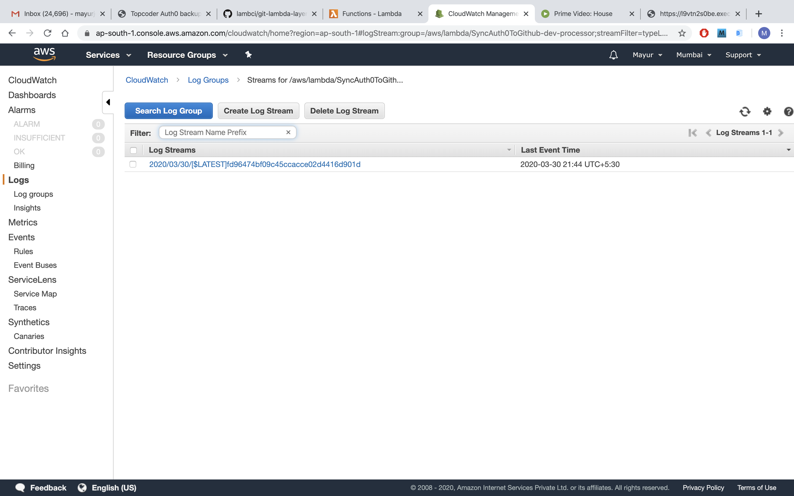
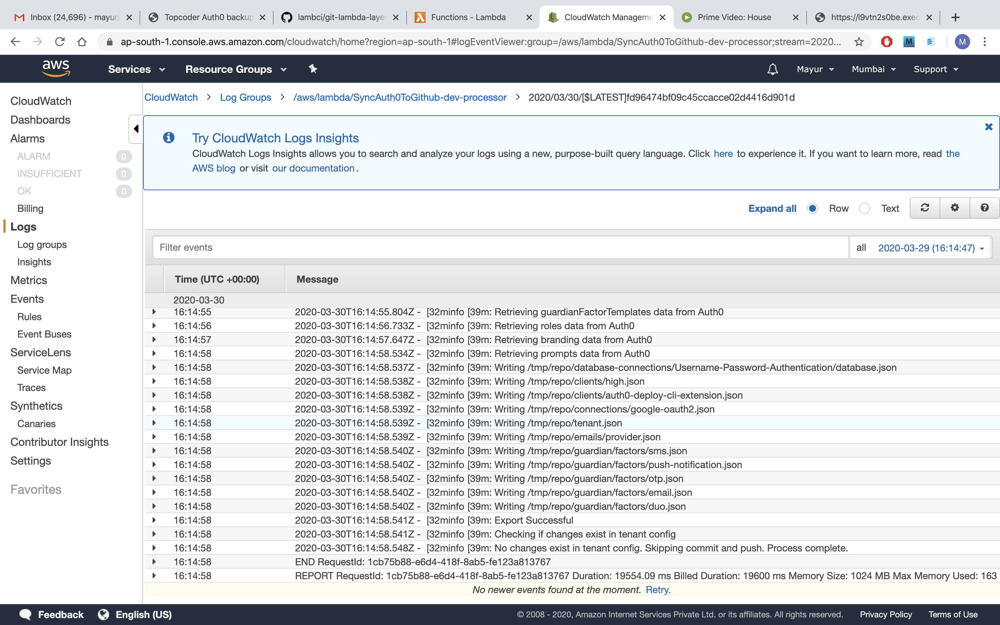
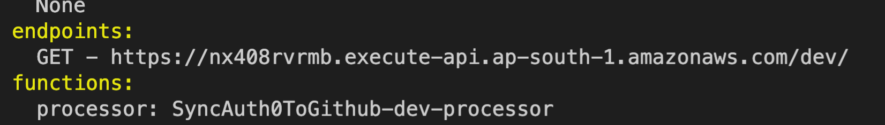
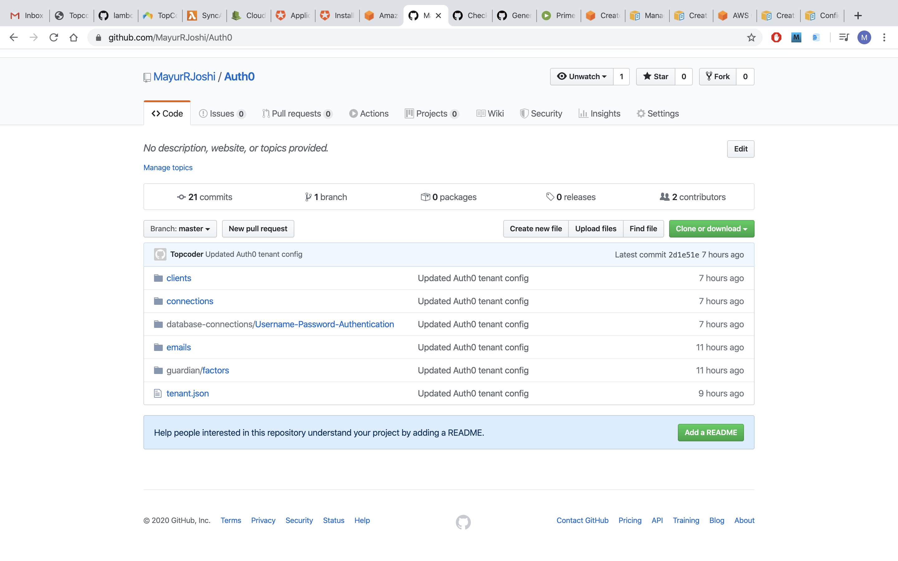
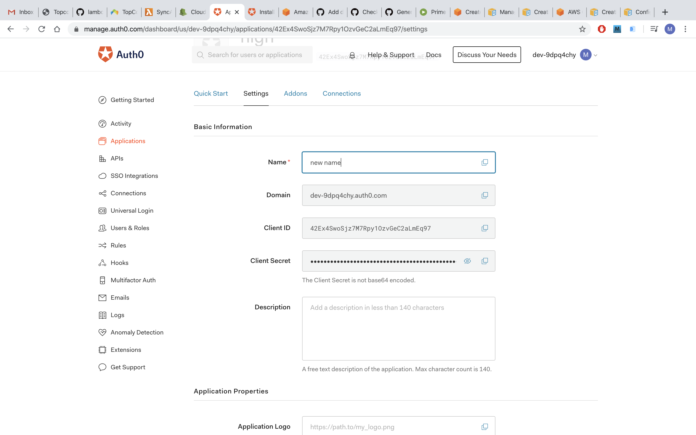
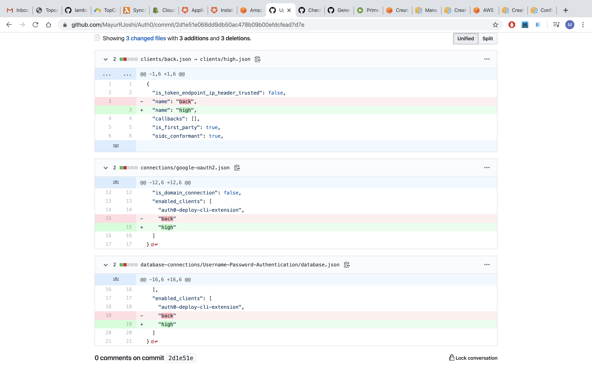

# Verification Guide

Verification video : https://www.youtube.com/watch?v=67ZmhnzZxSM

1. Go to the AWS Console -> CloudWatch -> Log groups. Once logs are generated by lambda, you will see a group called "/aws/lambda/SyncAuth0ToGithub-dev-processor". Click the group and click the *latest* stream inside it to view all the logs.

2. Once serverless deploys the lambda function, it will output a URL for the function such as,

  Clicking the URL will trigger the lambda function using a GET request. It will generate logs and when finished, push a commit to the github repository.

3. Click/Open the URL to start an initial sync. The request will return immediately. You should see logs generated in cloud watch and a commit pushed to the github repository when it completes.

The repository will contain all non empty config directories,

4. Now you can modify configuration values in Auth0. On the dashboard, click Application -> Default App.

Change the name of the app to something else, scroll down and click "Save changes"

5. Trigger the lambda function again. Once it completes, you can click on the commit to see the diff. You should see the name change reflected in Github.
For instance, I changed the name from "back" to "high" and the diff in the commit was,

Notice that the file names change too.

6. You can try modifying other config values and checking the commit diff in the github repository.
